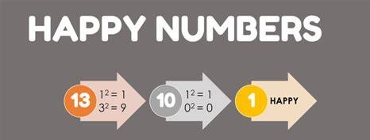

# Happy Number


A number is considered "happy" if by following a specific sequence, it results in 1. The sequence is as follows: Starting with any positive integer, replace the number by the sum of the squares of its digits, and repeat the process until the number equals 1 (where it will stay), or it loops endlessly in a cycle which does not include 1. These numbers for which this process ends in 1 are happy numbers.

For example, 19 is a happy number. Here's why:

- 1² + 9² = 82
- 8² + 2² = 68
- 6² + 8² = 100
- 1² + 0² + 0² = 1

As you can see, we eventually reached 1, which makes 19 a "happy" number.


## Directory Structure
```
Happy-Numbers/
|-- src/
| |-- main.py
|-- image/
| |-- banner.jpg
|-- README.md
|-- requirements.txt
```

## Project Structure
This project consists of a single Python script (`main.py`) that contains a function `is_happy_number()`. This function checks if a given number is a "happy" number.


## Prerequisites

- Python 3.7 +


## How To Run
- Clone the repository to your local system.
- Open your command line and navigate to the `Happy_Numbers` project directory.
- install necessary dependencies and **Prerequisites**.
- Add the current directory to the `PYTHONPATH`.
```bash
export PYTHONPATH=$PYTHONPATH:$(pwd)
```
- Run `Happy_Numbers` script.
```bash
python main.py
```

## License
This project is licensed under the terms of the MIT license.